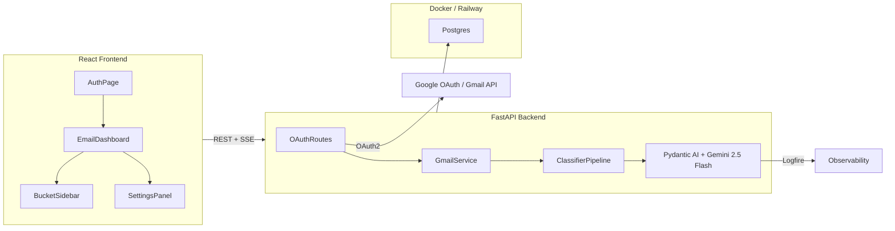
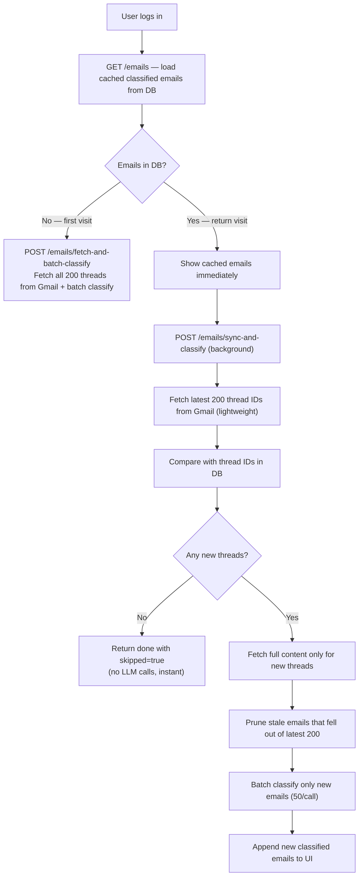
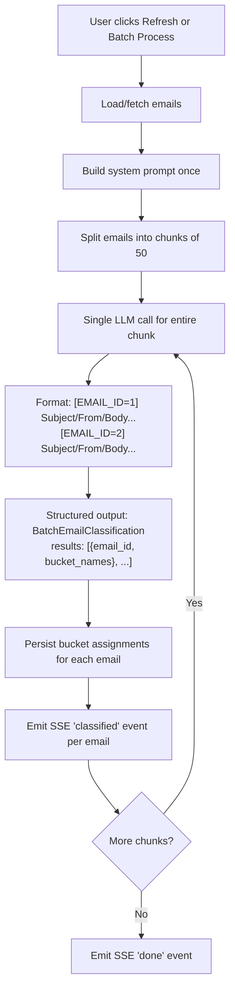
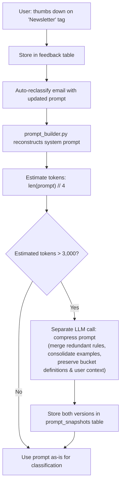
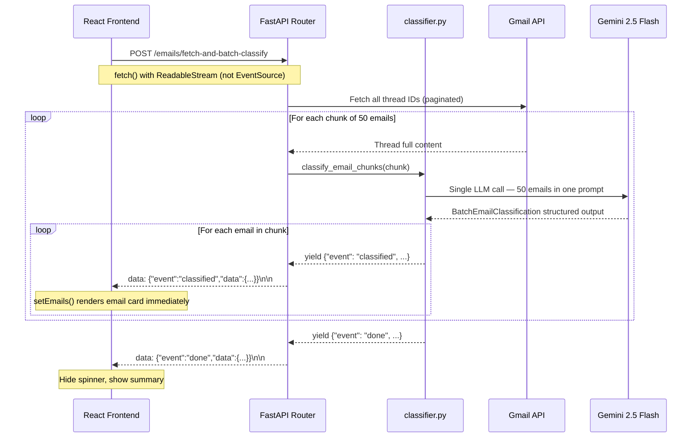
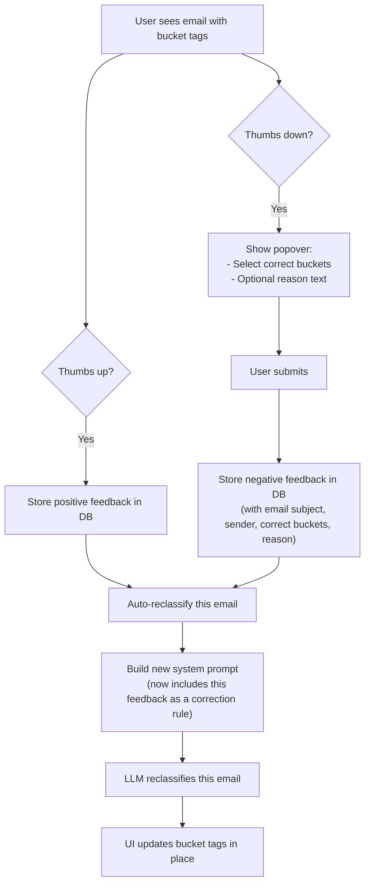

# Youtube demo link submission
[link](https://youtu.be/f7aApmJc5KI?si=z_6KWwVlGS8iLKE6)

# Inbox Concierge - Email Classification App

Smart email classification powered by AI. Authenticates with your Google account, fetches your last 200 email threads, and classifies them into customizable buckets using Gemini.

## Architecture Overview



- **Frontend**: React 19 + TypeScript + Vite + Tailwind CSS
- **Backend**: Python FastAPI + SQLAlchemy (async) + Pydantic AI
- **Database**: PostgreSQL 16 (Docker, mapped to host port 5433)
- **AI**: Google Gemini 2.5 Flash via Pydantic AI
- **Observability**: Pydantic Logfire

## Project Structure

```
/backend
  /app
    main.py              # FastAPI app, CORS, lifespan
    config.py            # Settings via pydantic-settings
    database.py          # SQLAlchemy async engine + session (pool_pre_ping)
    models.py            # SQLAlchemy ORM models
    schemas.py           # Pydantic request/response schemas
    auth_utils.py        # JWT + Fernet token encryption helpers
    /routers
      auth.py            # Google OAuth2 endpoints
      emails.py          # Email fetch + classify + list + reclassify + batch + sync
      buckets.py         # CRUD for buckets
      preferences.py     # User preference endpoints
      feedback.py        # Feedback submission endpoint
    /services
      gmail.py           # Gmail API wrapper (smart sync, chunked fetch, prune)
      classifier.py      # Pydantic AI classification (single, batch, stream)
      prompt_builder.py  # Dynamic prompt construction + compression
  requirements.txt
  Procfile               # Railway start command
  runtime.txt            # Python version pin for Railway
/frontend
  /src
    /components
      AuthScreen.tsx
      EmailDashboard.tsx
      BucketSidebar.tsx
      EmailList.tsx
      EmailCard.tsx
      SettingsPanel.tsx
      BucketManager.tsx
      Tooltip.tsx          # Instant hover tooltips for buttons
      DemoGate.tsx         # Password gate for demo deployment
    /hooks
      useAuth.ts
      useEmails.ts
      useBuckets.ts
      useFeedback.ts
    /api
      client.ts          # Axios instance + interceptors
      auth.ts
      emails.ts
      buckets.ts
      feedback.ts
    /types
      index.ts
    App.tsx
    main.tsx
    index.css
  index.html
  package.json
  vite.config.ts
  railway.json           # Railway build + deploy config
  .npmrc                 # npm legacy-peer-deps for build compat
docker-compose.yml
.env.example
```

## Database Schema

- **users**: `id`, `email`, `google_access_token` (encrypted), `google_refresh_token` (encrypted), `token_expiry`, `importance_context` (text), `created_at`
- **buckets**: `id`, `user_id`, `name`, `description`, `examples` (JSON array of few-shot examples), `created_at`
- **emails**: `id`, `user_id`, `thread_id`, `message_id`, `subject`, `sender`, `snippet`, `body_preview` (first ~500 chars), `date`, `created_at`
- **email_buckets**: `email_id`, `bucket_id` -- many-to-many junction table, composite PK `(email_id, bucket_id)`
- **feedback**: `id`, `user_id`, `email_id`, `bucket_id`, `is_positive`, `correct_bucket_ids` (JSON), `reason` (text), `created_at` -- unique constraint on `(user_id, email_id, bucket_id)` for upsert
- **prompt_snapshots**: `id`, `user_id`, `full_prompt_text`, `compressed_prompt_text`, `created_at`

Default buckets are seeded per user on first login: **Important**, **Can Wait**, **Auto-archive**, **Newsletter**, **Promotional**, **Social**. All buckets are user-owned and fully mutable -- users can delete any bucket (including defaults) or add custom ones.

## Classification Pipeline

The system supports multiple classification modes, all using the same dynamically constructed system prompt and Pydantic AI structured output.

### Smart Sync on Login



On return visits, the user sees their cached emails **instantly** while a background sync checks Gmail for new threads. If nothing changed, no LLM calls are made. If there are new emails, only those are fetched and classified -- existing classifications are preserved.

**Example**: You had 200 emails yesterday. Today 50 new emails arrived:

| Step | What happens |
|---|---|
| Gmail returns 200 thread IDs | Latest 200 (50 new + 150 existing) |
| Compare with DB (200 existing) | 50 new IDs not in DB, 50 stale IDs in DB but not in Gmail |
| Fetch full content | Only for the 50 new threads (not the 150 already in DB) |
| Prune | Delete the 50 oldest that fell out of the top 200 |
| Classify | Batch classify only 50 new emails (~1 LLM call) |
| Result | DB has exactly 200 emails: 150 kept + 50 new |

### Batch Processing Mode ("Refresh" / "Batch Process" button)



Classifies **50 emails per LLM call** (`BATCH_SIZE = 50` in `classifier.py`). All emails in a chunk are formatted into a single prompt with `[EMAIL_ID=N]` markers. The LLM returns a `BatchEmailClassification` structured output mapping each email ID to its bucket names. This reduces ~200 LLM calls to ~4 batch calls, significantly improving throughput.

- **Sync & Classify** button: fetches latest 200 threads from Gmail, prunes stale, then batch-classifies all
- **Reclassify** button: reclassifies all existing stored emails without re-fetching from Gmail

**Batch prompt format:**

```
Classify each of the following emails. Return a result for every EMAIL_ID.

[EMAIL_ID=42]
Subject: 40% OFF Everything
From: Old Navy
Date: 2026-03-14
Body: Shop now and save big...

---

[EMAIL_ID=43]
Subject: Your weekly digest
From: Substack
Date: 2026-03-14
Body: Here are this week's top posts...
```

**Batch structured output (Pydantic model):**

```python
class SingleEmailResult(BaseModel):
    email_id: int
    bucket_names: list[str]

class BatchEmailClassification(BaseModel):
    results: list[SingleEmailResult]
```

### Per-Email Reclassify (inline refresh button)

Each email card has an inline refresh button that sends a single `POST /emails/{id}/reclassify` request. This builds the system prompt, classifies just that one email, updates its bucket assignments in the DB, and returns the updated email. The UI updates in place without a full page reload.

This is also triggered automatically after feedback (thumbs up/down) to immediately test whether the updated prompt produces better results.

### Dynamic System Prompt

The system prompt is built fresh at the start of each classification run by `prompt_builder.py`:

1. **Base instructions**: "You are an email classifier..." with rules about non-exclusive bucket assignment
2. **User preferences**: from Settings textarea, injected verbatim (e.g., "I use this email for job hunting and open-source projects")
3. **Bucket definitions**: all buckets with user-editable descriptions
4. **Few-shot examples**: user-provided example emails for each bucket
5. **Correction rules with email context**: derived from feedback, including the actual email subject and sender as few-shot examples (e.g., `Email "40% OFF Everything" from "Old Navy" should NOT be "Job Application Related"`)
6. **Output instructions**: "Assign to one or more matching buckets. Return bucket names exactly as listed."

### Prompt Compression



Token count is estimated via `len(prompt) // 4`. When it exceeds **3,000 tokens** (`PROMPT_TOKEN_THRESHOLD` in `prompt_builder.py`), a separate Gemini 2.5 Flash call compresses the prompt. The compressor is instructed to:

- Merge redundant or similar correction rules into general patterns
- Consolidate few-shot examples that express the same classification pattern
- Preserve all bucket definitions and their descriptions exactly
- Keep the user's importance context verbatim
- Never drop information, only condense

Both the original and compressed prompts are stored in `prompt_snapshots` for auditability. If the compression LLM call fails, the original uncompressed prompt is used as a fallback.

### SSE Streaming Architecture

All classification endpoints stream results to the frontend in real time using **Server-Sent Events (SSE)**. This lets the UI update progressively — each email appears as soon as it is classified, rather than waiting for the entire batch to finish.



**Backend — SSE producer**

The FastAPI endpoint wraps an async generator in `EventSourceResponse` (from `sse-starlette`). Two internal stream helpers feed the same unified pipeline:

- **`_pipeline_stream`** — uses `fetch_threads_chunked`, an async generator in `gmail.py` that fetches Gmail threads and yields them to the classifier in chunks as each batch is saved to the DB. This enables **pipelining**: chunk N+1 is being fetched from Gmail while chunk N is being classified by the LLM.
- **`_db_classify_stream`** — loads all existing emails from the DB, wraps them into chunks via `_chunks_from_list`, and feeds them into the same pipeline without any Gmail round-trip.

Both converge into `classify_email_chunks` in `classifier.py`, which is the single unified classification pipeline:

```
chunks (async generator)
  └─ classify_email_chunks(user, chunks, db, batch_size)
       ├─ build_system_prompt(user, db)          — once, before loop
       ├─ async for chunk, total in chunks:
       │    ├─ [batch_size == 1]  → classify_email(email, ...)      — 1 LLM call/email
       │    └─ [batch_size == 50] → classify_emails_batch(chunk, ...) — 1 LLM call/50 emails
       │    └─ yield {"event": "classified", "data": {...}}  — per email
       └─ yield {"event": "done", "data": {...}}
```

**Frontend — SSE consumer**

The native browser `EventSource` API only supports GET requests, so `streamClassification()` in `api/emails.ts` uses `fetch()` POST with `response.body.getReader()` to consume the stream manually:

1. A `TextDecoder` + newline buffer parses incoming `data:` lines from the chunked response body.
2. Each parsed JSON object is dispatched to the `onEvent` callback in `useEmails.ts`.
3. The hook updates React state based on the event type:

| Event | What the hook does |
|---|---|
| `classified` | Upserts email into `emails` state — if it already exists (reclassify), updates bucket tags in place; otherwise appends it. Updates `progress` counter. Sidebar bucket counts recompute automatically via `useMemo`. |
| `error` | Increments `progress` only — email is skipped without crashing the stream. |
| `done` | Sets the summary banner (`classified X / total Y`) and clears the `classifying` spinner. If `skipped: true` (smart sync found no new emails), nothing changes in the UI. |

4. `startClassification` returns an `AbortController`-backed cancel function — called on component unmount to cleanly abort the `fetch` stream.

**SSE event payload reference:**

| Event | Key fields |
|---|---|
| `classified` | `email_id`, `thread_id`, `subject`, `sender`, `snippet`, `date` (UTC ISO), `bucket_names`, `bucket_ids`, `progress`, `total` |
| `error` | `email_id`, `subject`, `error` (message), `progress`, `total` |
| `done` | `classified` (count), `failed` (count), `total`, `skipped` (bool, smart-sync only) |

### Error Handling

Each email classification is wrapped in try/except with up to **2 retries** (`MAX_RETRIES = 2`, exponential backoff with `RETRY_BASE_DELAY = 1.0s`). If all retries fail, the email is skipped and an `error` SSE event is sent. The overall run continues -- a single failure does not abort remaining emails. A summary at the end reports total classified vs. failed.

## Email Lifecycle

### Smart Sync (`sync_threads`)

Used on return visits. Compares Gmail thread IDs with the DB to minimize work:

1. Fetches latest 200 **thread IDs only** from Gmail (lightweight -- no content)
2. Queries existing thread IDs for this user in the DB
3. Computes diff: `new = gmail_ids - db_ids`, `stale = db_ids - gmail_ids`
4. Fetches full content (`threads.get`) **only for new threads**
5. Prunes stale emails (deletes email + bucket assignments + feedback)
6. Returns `(new_emails, all_emails)` -- only new emails need classification

### Full Fetch (`fetch_threads_chunked`)

Used by "Sync & Classify". Re-fetches all 200 threads from Gmail as a pipelined async generator:

1. Fetches latest 200 thread IDs from Gmail (paginated, 100 per page)
2. For each thread, fetches full content and upserts into the DB
3. **Yields emails in chunks** (default 50) as they're saved — enabling classification to start before all threads are fetched
4. After all threads are processed, prunes stale emails that fell out of the latest 200

### Rolling Window

The DB always holds exactly the latest 200 Gmail threads per user. When new emails arrive, old ones that fall out of the top 200 are automatically deleted along with their bucket assignments and feedback records.

## Feedback System

### Feedback UX



1. Each email card shows assigned buckets as colored tag pills
2. Each tag pill has inline thumbs-up / thumbs-down icons
3. **Thumbs up**: single click, sends positive feedback, icon fills in green
4. **Thumbs down**: opens an inline popover with:
   - Checkbox list: "Where should this email go instead?"
   - Free-text input: "Why is this wrong? (optional)"
   - Submit button
5. After feedback (up or down), the email is **automatically reclassified** using the updated prompt that now includes the feedback as a correction rule
6. The UI updates the email's bucket tags in place to show the new classification result

### Feedback as Few-Shot Examples

Feedback is injected into the system prompt as "Correction Rules" with the actual email content, so the LLM can learn patterns from concrete examples:

```
## Correction Rules (learned from user feedback)
- Email "40% OFF Everything + get $6 men's tees" from "Old Navy" should NOT be
  "Job Application Related", should be: 'Promotional'. Reason: "this is not job
  related, job related should be application receipts and interview schedules"
- Email "EY is hiring a Associate Product Manager" from "LinkedIn" is correctly
  classified as "Job Application Related"
```

Each feedback row becomes one bullet in the prompt. The email's subject and sender are included so the LLM can generalize the pattern to similar emails (e.g., "marketing emails from retailers are Promotional, not Job Application Related").

## API Endpoints

| Endpoint | Method | Description |
| --- | --- | --- |
| `/auth/login` | GET | Get Google OAuth URL |
| `/auth/callback` | GET | OAuth callback, returns JWT |
| `/auth/me` | GET | Current user info |
| `/emails` | GET | List classified emails, filterable by `?bucket_id=X` |
| `/emails/sync-and-classify` | POST | Smart sync: fetch new threads only, batch classify only new emails (SSE) |
| `/emails/fetch-and-batch-classify` | POST | Full fetch 200 threads from Gmail + batch classify all (SSE) |
| `/emails/fetch-and-classify` | POST | Full fetch 200 threads from Gmail + classify one-by-one (SSE) |
| `/emails/reclassify` | POST | Reclassify all stored emails one-by-one (SSE) |
| `/emails/batch-classify` | POST | Reclassify all stored emails in batches of 50 (SSE) |
| `/emails/{id}/reclassify` | POST | Reclassify a single email, returns updated email |
| `/buckets` | GET | List all buckets with email counts |
| `/buckets` | POST | Create a new bucket |
| `/buckets/{id}` | PUT | Update bucket name, description, or examples |
| `/buckets/{id}` | DELETE | Delete any bucket (cascades to email_buckets + feedback) |
| `/feedback` | POST | Submit thumbs up/down for an email-bucket pair (upserts) |
| `/feedback` | GET | List all feedback for current user |
| `/preferences` | GET/PUT | Get/update user importance context |
| `/health` | GET | Health check |

## UI Features

### Header Actions

- **Sync & Classify**: Fetches latest 200 threads from Gmail, prunes stale emails, and batch-classifies all (50 per LLM call)
- **Reclassify**: Reclassifies all stored emails in batches of 50 per LLM call (no Gmail fetch, uses existing emails in DB)
- **Settings**: Opens the settings panel for bucket management and email preferences

All buttons show instant styled tooltips on hover describing what they do.

### Sidebar

- Shows all buckets with **live email counts** that update dynamically during SSE classification (computed client-side from the email state, not from a server round-trip)
- "All" view shows every email that has at least one bucket assignment
- "Add Bucket" button opens the settings panel

### Email Cards

- Subject, sender, date, and snippet preview (not clickable)
- Colored bucket tag pills with inline thumbs-up / thumbs-down
- **Refresh button** per email to reclassify just that email via a single LLM call
- Feedback (thumbs up/down) automatically triggers reclassification of that email

### Settings Panel

- **Email Preferences**: textarea with hints ("What do you use this email for? What do you like to focus on?") -- injected verbatim into the classification prompt
- **Bucket Manager**: edit name, description, and few-shot examples for each bucket; add or delete buckets
- **Save**: persists preference and bucket changes without reclassifying
- **Save & Reclassify**: persists changes and reclassifies all emails one-by-one (slower but more accurate)
- **Save & Batch**: persists changes and reclassifies all emails in batches of 50 (faster)

## Prerequisites

- Python 3.12+
- Node.js 18+
- Docker (for PostgreSQL)
- A Google Cloud project with OAuth credentials, Gmail API enabled, and Generative Language API enabled

## Google Cloud Console Setup

1. Go to [console.cloud.google.com](https://console.cloud.google.com)
2. Create a new project (e.g., "Inbox Concierge")
3. Enable the **Gmail API**: APIs & Services > Library > search "Gmail API" > Enable
4. Enable the **Generative Language API**: APIs & Services > Library > search "Generative Language API" > Enable
5. Configure the **OAuth consent screen**:
   - User Type: External
   - Add your email as a test user
   - Scopes: `gmail.readonly`, `openid`, `email`, `profile`
6. Create **OAuth 2.0 credentials**:
   - APIs & Services > Credentials > Create Credentials > OAuth 2.0 Client ID
   - Application type: **Web application**
   - Authorized redirect URIs: `http://localhost:8000/auth/callback`
7. Copy the Client ID and Client Secret
8. Get a **Gemini API key**: [aistudio.google.com](https://aistudio.google.com) > Get API key

## Setup & Running

### 1. Environment Variables

```bash
cp .env.example .env
```

Fill in your `.env`:

```
GOOGLE_CLIENT_ID=your-client-id
GOOGLE_CLIENT_SECRET=your-client-secret
GOOGLE_API_KEY=your-gemini-api-key
JWT_SECRET=any-random-string
ENCRYPTION_KEY=<generate with: python -c "from cryptography.fernet import Fernet; print(Fernet.generate_key().decode())">
```

Optional (for Logfire observability):
```
LOGFIRE_TOKEN=your-logfire-token
```

### 2. Start PostgreSQL

```bash
docker compose up -d
```

PostgreSQL 16 runs on **host port 5433** (maps to 5432 inside the container) to avoid conflicts with any local Postgres.

**DBeaver / DB client connection**: Host `localhost`, Port `5433`, Database `inbox_concierge`, User `inbox`, Password `inbox`.

### 3. Backend

```bash
cd backend
python3 -m venv venv
source venv/bin/activate
pip install -r requirements.txt
uvicorn app.main:app --reload --port 8000
```

The backend creates all database tables automatically on startup (no Alembic migrations needed).

### 4. Frontend

```bash
cd frontend
npm install
npm run dev
```

The frontend runs on `http://localhost:5173`.

## Usage

1. Open `http://localhost:5173`
2. Click **Sign in with Google** and authorize Gmail access
3. **First login**: your last 200 email threads are fetched and batch-classified (~4 LLM calls)
4. **Return visits**: cached emails display instantly, background sync checks for new emails and only classifies those
5. Use the sidebar to filter by bucket
6. Give thumbs up/down on bucket tags -- the email is automatically reclassified with the updated prompt
7. Click the refresh icon on any email card to reclassify just that email
8. Use **Sync & Classify** to re-fetch from Gmail and batch-classify all emails
9. Use **Reclassify** to reclassify existing emails without re-fetching
10. Open **Settings** to:
    - Describe your email priorities (personalizes the AI classifier)
    - Edit bucket names, descriptions, and examples
    - Add or delete buckets
    - **Save** (no reclassify), **Save & Reclassify** (one-by-one), or **Save & Batch** (50 per call) to apply changes

---

## Deployment (Railway)

The app can be deployed to [Railway](https://railway.com) as three services: Postgres, Backend (FastAPI), and Frontend (React).

### Prerequisites

- A Railway account ($5/month Hobby plan — no free tier for always-on services)
- Your repo pushed to GitHub
- Google Cloud Console access for OAuth configuration

### 1. Create a Railway Project

1. Go to [railway.com](https://railway.com) and create a new project
2. Add a **Postgres** service from the database menu (one click)
3. Add a **Backend** service — connect your GitHub repo, set **Root Directory** to `/backend`
4. Add a **Frontend** service — connect the same repo, set **Root Directory** to `/frontend`

### 2. Backend Environment Variables

Set these in the Backend service's **Variables** tab:

| Variable | Value |
|---|---|
| `DATABASE_URL` | Railway auto-injects this when you link Postgres. Change the scheme from `postgresql://` to `postgresql+asyncpg://` |
| `GOOGLE_CLIENT_ID` | From your Google Cloud Console |
| `GOOGLE_CLIENT_SECRET` | From your Google Cloud Console |
| `GOOGLE_API_KEY` | Your Gemini API key |
| `JWT_SECRET` | A random secret string |
| `ENCRYPTION_KEY` | A Fernet encryption key (generate with `python -c "from cryptography.fernet import Fernet; print(Fernet.generate_key().decode())"`) |
| `FRONTEND_URL` | The frontend's Railway URL, e.g. `https://inbox-concierge-frontend.up.railway.app` |
| `GOOGLE_REDIRECT_URI` | `https://<backend-url>/auth/callback` |

### 3. Frontend Environment Variables

Set these in the Frontend service's **Variables** tab:

| Variable | Value |
|---|---|
| `VITE_API_BASE` | The backend's Railway URL, e.g. `https://inbox-concierge-backend.up.railway.app` |
| `VITE_DEMO_PASSWORD` | A password to protect the demo (visitors must enter this to access the app) |

### 4. Google Cloud Console

1. Go to **APIs & Services > OAuth consent screen** and click **Publish App** to move from Testing to Production (users will see an "unverified app" warning — they click Advanced > "Go to app" to proceed)
2. Go to **APIs & Services > Credentials** and update your OAuth Client ID:
   - Add `https://<backend-url>/auth/callback` to **Authorized redirect URIs**
   - Add `https://<frontend-url>` to **Authorized JavaScript origins**

### 5. Demo Password Gate

The frontend includes a password gate controlled by `VITE_DEMO_PASSWORD`. When set, visitors must enter the password before accessing the app. The password is checked client-side and stored in `sessionStorage` (persists until the browser tab is closed). If `VITE_DEMO_PASSWORD` is not set, the gate is skipped (useful for local development).

---

## Future Improvements

### Scalability
- Horizontal backend scaling with load balancer (sticky sessions for SSE, or migrate to WebSockets)
- Database read/write separation with read replicas for listing queries
- Rate limiting per user to stay within Gmail API quotas
- Connection pooling via PgBouncer for multi-replica deployments

### Background Classification
- Replace on-login sync with a background worker (Celery/ARQ + Redis) that pre-classifies emails
- Use Gmail push notifications (Google Pub/Sub watches) for near-real-time classification without polling
- Users open the app to fully-tagged emails with zero LLM wait time

### LLM-as-Judge Eval Pipeline
- Auto-generate test cases from thumbs-up/down feedback (e.g., "email X should → [A, B], not → [C]")
- Run the eval suite before deploying prompt changes, model upgrades, or bucket definition edits
- Track precision/recall per bucket over time

### Chat Over Emails
- RAG-based chatbot: embed email corpus (pgvector), let users ask questions like "what did my manager say about Q3?"
- Return answers with cited email references

### Security Hardening
- Move secrets to a secrets manager (AWS/GCP) with automatic key rotation
- Replace in-memory PKCE state (`_pending_states`) with Redis or a short-TTL DB table (survives restarts, works across replicas)
- Add server-side demo auth middleware, CSRF protection, and rate limiting on auth endpoints

### Cost & Model Optimization
- Route "easy" emails (newsletters, promos) to a smaller/cheaper model; reserve the full model for ambiguous cases
- Fine-tune a lightweight classifier on accumulated user feedback data
- Cache classifications for recurring sender + subject patterns to skip LLM calls

### Data & Observability
- Archive old emails and classifications to cold storage for analytics (currently lost on rolling window prune)
- Alerting on LLM latency spikes, classification failure rates, and Gmail API quota usage
- Per-user cost tracking (LLM tokens consumed)

### Prompt Versioning
- Version-controlled prompt registry with rollback support
- A/B test prompt versions against the eval suite before production rollout
